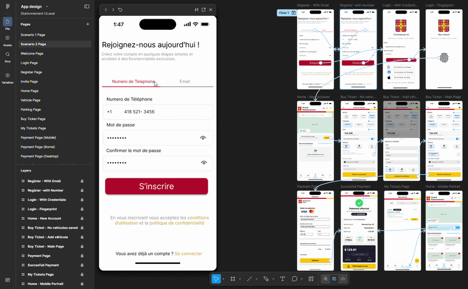
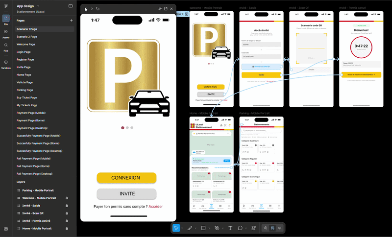
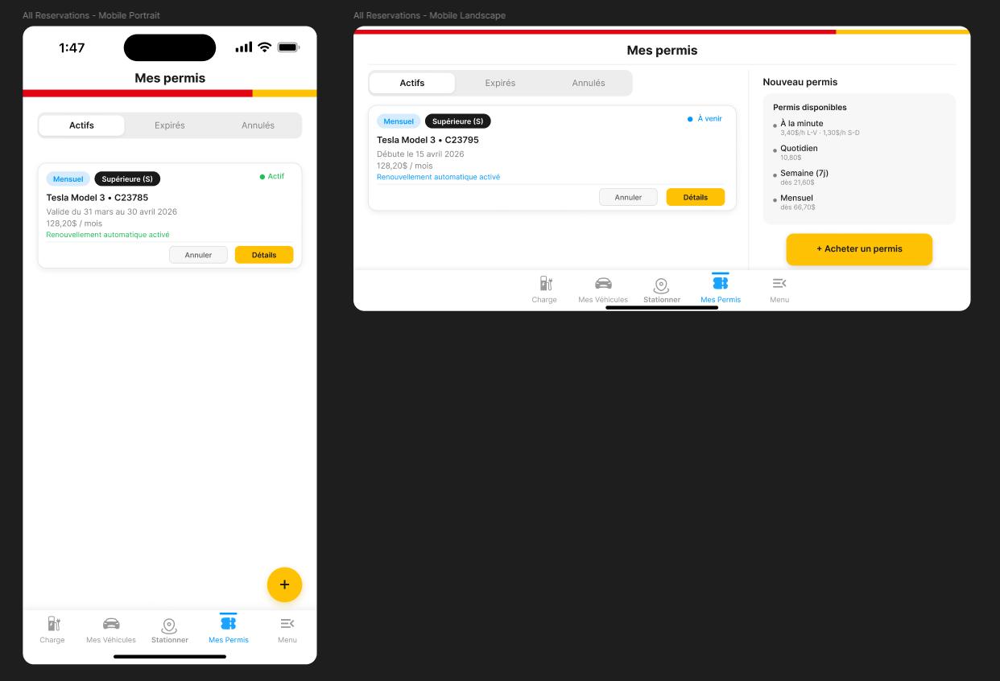
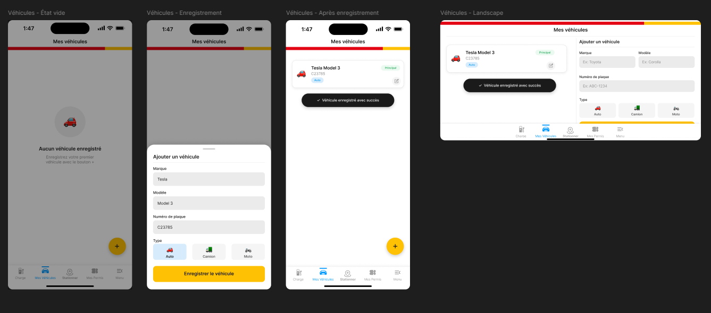
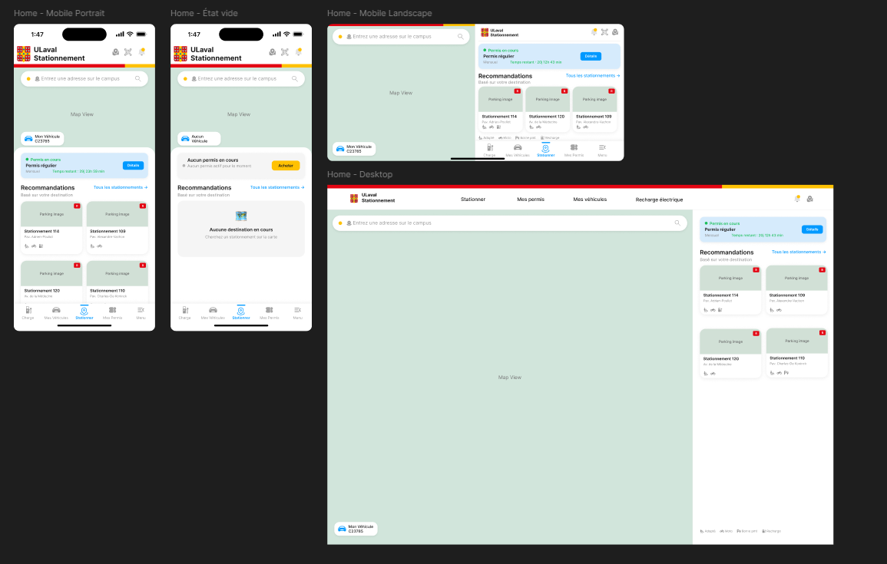

# ULaval Parking — Mobile App Design

UI/UX design project for a parking permit management app at Université Laval. Built for the Human Computer Interface course (GLO-4000) — research-driven, persona-based, and designed for 4 device formats.

> Figma prototype only. No code.

🔗 [Full Demo 1 Video](https://youtu.be/MvOC1vZpEaw)

🔗 [Full Demo 2 Video](https://youtu.be/pq_Mg4eSOGs)

🔗 [Figma Project Link](https://www.figma.com/design/iM3hq6BYRSf3e4c077zRUp/App-design?node-id=876-1350&t=sabLK07zGe5pBChX-1)

---

## User Scenarios

### Scenario 1 — Sign up and purchase a monthly permit
```
User opens the app
  └─ Creates an account (Sign Up)
       └─ Logs in
            └─ Home → browses Parking page
                 └─ Click on Buy Ticket
                      └─ Chooses a monthly permit and the Superior Category
                           └─ Add new vehicle and start date
                                └─ Proceeds to Payment
                                     └─ Receives confirmation
```

## 📹 Demo



### Scenario 2 — Guest login, unique code entry, and permit activation
```
User opens the app
  └─ Logs in as a guest
       └─ Adds license plate
            └─ Enters unique permit code or scans QR code
                 └─ Activates permit
                      └─ Confirmation with active permit details
```

## 📹 Demo



---

## Overview

The app allows ULaval students and staff to find parking lots, purchase permits (S/R/E categories), and manage their tickets — from daily to monthly.

Designed for: **mobile portrait**, **mobile landscape**, **desktop**, and **kiosk**.

---

## User Research Approach

The design follows a **persona-based approach** derived from behavioral schema analysis:

1. Identify behavioral variables across 5 dimensions — Activities, Attitudes, Aptitudes, Motivations, and Skills
2. Map survey participants onto normalized scales (1–3) per variable
3. Cluster participants by behavioral proximity
4. Derive personas from dominant clusters

This ensures design decisions are grounded in real observed behaviors, not assumptions.

---

## Screens Designed

- **Login / Sign Up**
- **Home** — recommendations, quick access, nearby lots
- **Parking** — full lot listing, filters (pavilion, category, type)
- **Buy Ticket** — permit details, type selection, vehicle, date
- **Payment** — payment form and summary
- **Succesfull and fail Payment Page** - payment validation
- **My Tickets** — active and past permits
- **Vehicle** — vehicle management

---

## 📸 Screenshots

*My Tickets Page*



*Vehicle Page*



*Home Page*



---

## Tech & Tools

- Figma (design, prototyping, auto-layout)
- WCAG AA accessibility compliance
- Mobile-first, responsive across 4 formats

---

## My Contributions

- Behavioral variable identification and participant distribution (behavioral schemas)
- Home page
- Parking page
- Buy Ticket page
- Vehicle Page
- Guest page
- My Tickets page

---

## Contributors

University team project — GLO-4000, Université Laval.

- Petiton Wiseley Paul-Enzer
- Emmanuella Iris Andréa Lehe
- Aliya Imann Ouedraogo
- Louis Nathan Kameni
- Auriane Vadelle Djou Donchi
- Guerby Benoit
- Chadi Chibli
- Kris Bani Nguinano

---

[petiton.dev](https://petiton.dev)
